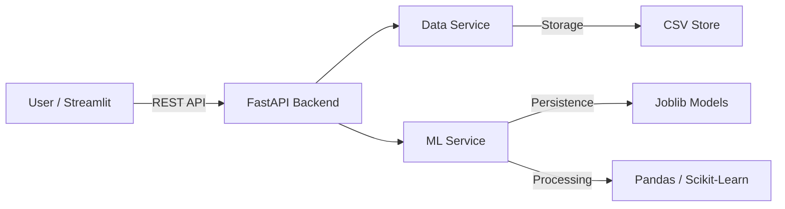

# 🤖 AutoML Predictive Insights: Full-Stack AI Dashboard

> **Transform raw CSV data into actionable predictive insights in seconds.**

AutoML Predictive Insights is a powerful, full-stack web application designed for data scientists and analysts. It automates the entire machine learning pipeline—from data ingestion and cleaning to model training, evaluation, and real-time inference.

---

## 🚀 Key Features

### 1. Dynamic Data Ingestion
- **Schema Agnostic**: Upload any CSV file without worrying about predefined schemas.
- **Structural Analysis**: Automatic detection of data types, unique values, and missingness.
- **Smart Imputation**: Automatically handles missing values using mean/mode strategies.

### 2. Automated Machine Learning (AutoML)
- **Problem Detection**: The system intelligently decides whether to perform **Classificaton** (Logistic Regression) or **Regression** (Linear Regression) based on the target column's statistical profile.
- **Feature Engineering**: Automated One-Hot Encoding for categorical features ensures your model is ready for any data.
- **Model Persistence**: Models are serialized using `joblib` for instant recall.

### 3. Interactive Visualizations
- **Exploratory Data Analysis (EDA)**: Dynamic histograms with marginal box plots for distribution analysis.
- **Correlation Engine**: Fully interactive heatmap to identify feature relationships.
- **Metric Dashboard**: Real-time tracking of Accuracy, R² Score, and training time.

### 4. Real-time Prediction API
- **Dynamic Form Generation**: The UI automatically builds input fields based on your dataset.
- **Instant Inference**: Get predictions immediately after training with a professional gauge chart visualization.

---

## 🏗️ Architecture



- **Frontend**: Streamlit + Plotly (Reactive Dashboard)
- **Backend**: FastAPI (High-performance API)
- **ML Engine**: Scikit-Learn (Algorithms) & Pandas (Transformation)
- **Storage**: Local filesystem for CSVs and serialized models.

---

## 🛠️ Installation & Setup

### Prerequisites
- Python 3.9 or higher
- Windows/Linux/macOS

### 1. Clone & Environment Setup
```bash
# Clone the repository (if applicable)
# git clone https://github.com/Swara-art/AutoML

# Create a virtual environment
python -m venv .venv
source .venv/bin/activate  # Windows: .venv\Scripts\activate
```

### 2. Install Dependencies
```bash
pip install -r requirements.txt
```

### 3. Launch the Application
You will need two terminal windows open:

**Terminal 1: Backend**
```bash
python -m uvicorn app.main:app --reload
```
*API will be available at: http://127.0.0.1:8000*

**Terminal 2: Frontend**
```bash
streamlit run frontend/app.py
```

---

## 📖 API Documentation

The backend provides a fully documented Swagger UI. Once the backend is running, visit: `http://127.0.0.1:8000/docs`

| Endpoint | Method | Description |
| :--- | :--- | :--- |
| `/upload` | `POST` | Upload a CSV file and return a unique `file_id`. |
| `/analyze/{id}` | `GET` | Get detailed column-level metadata and missing value counts. |
| `/train/{id}` | `POST` | Train a model on the specified target column. |
| `/predict/{id}` | `POST` | Perform real-time inference on a JSON payload. |
| `/data/{id}` | `GET` | Retrieve the full processed dataset for visualization. |

---

## 🔮 Roadmap

- [ ] Support for Advanced Models (Random Forest, XGBoost).
- [ ] Exportable Model Artifacts (Docker/ONNX).
- [ ] Data Export (Cleaned CSV download).
- [ ] Model Interpretation (SHAP/LIME integration).
- [ ] Multi-file support and database integration (PostgreSQL).

---

## 🤝 Troubleshooting

**Q: The frontend says "Connection Error"**
*A: Ensure the FastAPI backend is running on port 8000 and that CORS is allowed.*

**Q: My CSV isn't uploading properly.**
*A: Ensure the file is a standard comma-separated CSV. If it uses semicolons, you may need to update the `pd.read_csv` logic in `file_service.py`.*

---

*Built with ❤️ by the AutoML Team*
